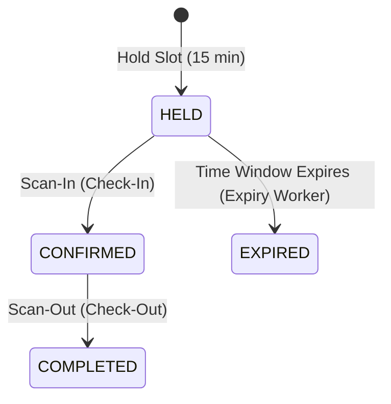

# System Architecture

This document details the architectural layout, core design patterns, and system invariants of the Smart Park & Ride application.

---

## Core Architecture Principles

### 1. Data Source Roles
* **PostgreSQL (Persistent Storage):** Canonical source of truth for long-term records including confirmed bookings, slot mappings, operator users, and audit logs.
* **Redis (Transient Storage & Locking):** Strictly used to cache temporary session holds (TTL-based), track rate limiting counters, and manage lock acquisitions to prevent double booking slots.

### 2. Layer Separation
* **Routers (Presentation):** FastAPI routers are thin, descriptive, and declarative. Their duties are limited to validating request bodies, handling HTTP exception wrapping, and mapping response schemas.
* **Services (Business Logic):** Realized in `backend/services/slot_service.py`, this layer acts as the single entry point for slot booking and modification, enforcing state machine invariants.
* **Database (Persistence):** SQL scripts and ORM commands managing standard transaction scopes.

---

## Booking Lifecycle State Machine

A reservation transitions through strict phases to maintain data consistency.

### State Definitions
1. **HELD:** A temporary hold placed on a parking slot. Backed by a Redis key with a Time-To-Live (TTL) of 15 minutes.
2. **CONFIRMED:** The vehicle has checked in at the parking facility entry gate. The slot status becomes `'occupied'` in Postgres and `'occupied:{booking_id}'` in Redis (clearing the TTL hold and locking it permanently until scan-out).
3. **COMPLETED:** The vehicle has checked out and departed the facility. The slot is returned to `'available'` in both Redis and Postgres.
4. **EXPIRED:** A held reservation that did not receive scan-in confirmation before its 15-minute window expired. Expired holds trigger a penalty strike for the user.
5. **NO_SHOW:** Reserved for manual operator overrides or physical check-in failures.

### Consistency Worker
* A standalone, decoupled background worker process (`expiry_worker.py`) running as a separate container service polls and reconciles state inconsistencies. It identifies PostgreSQL records stuck in `HELD` that have expired in Redis, updating their status to `EXPIRED`, incrementing user penalty counts, and applying 24-hour bans on 3 strikes.

---

## Security & Authentication

* **No Hardcoded Credentials:** The application parses database, cache, CORS settings, and default logins from environment variables initialized inside `backend/config.py`.
* **HS256 JWT Authorization:** Administrators, Operators, and Commuters acquire signed JSON Web Tokens. Commuters verify via passwordless phone OTP, and employees authenticate with standard credentials.
* **Role-Based Access Control (RBAC):** Privileges are checked before execution. Administrators can override, export data, and modify slot counts; Operators are limited to scanning operations and manual overrides; Commuters can hold slots and retrieve their saved vehicles.
* **Vehicle & User Registry:** Relational mapping of `phone` -> `user` and `user` -> `user_vehicles` dynamically populates the database and associates slot reservations directly with unique commuter accounts rather than global defaults.
* **CORS Settings:** A strict CORS middleware matches client origins against variables dynamically supplied at runtime.

---

## Frontend Delivery Configuration
* **Environment Agnosticism:** To bypass heavy build-time configurations, the static Vanilla HTML/JS frontend queries backend URLs using `window.APP_CONFIG` initialized from `frontend/config.js` at runtime.

