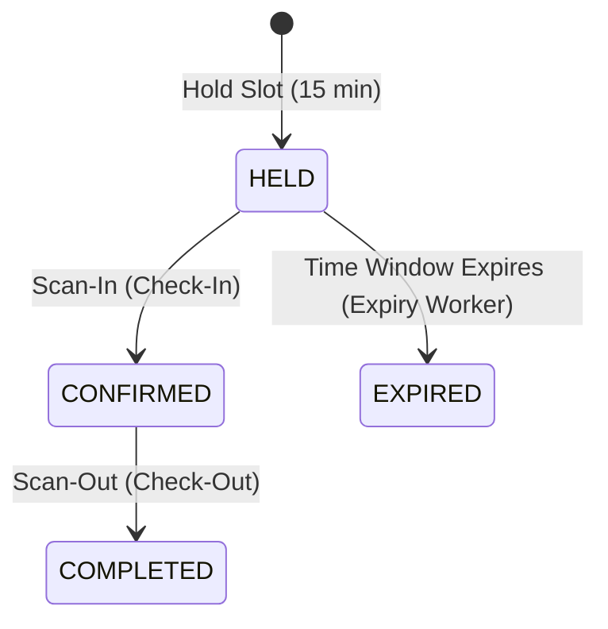

# System Architecture

This document details the architectural layout, core design patterns, and system invariants of the Smart Park & Ride application.

---

## Core Architecture Principles

### 1. Data Source Roles
* **PostgreSQL (Persistent Storage):** Canonical source of truth for long-term records including confirmed bookings, slot mappings, operator users, and audit logs.
* **Redis (Transient Storage & Locking):** Strictly used to cache temporary session holds (TTL-based), track rate limiting counters, and manage lock acquisitions to prevent double booking slots.

### 2. Layer Separation
* **Routers (Presentation):** FastAPI routers are thin, descriptive, and declarative. Their duties are limited to validating request bodies, handling HTTP exception wrapping, and mapping response schemas.
* **Services (Business Logic):** Realized in `backend/services/slot_service.py`, this layer acts as the single entry point for slot booking and modification, enforcing state machine invariants.
* **Database (Persistence):** SQL scripts and ORM commands managing standard transaction scopes.

---

## Booking Lifecycle State Machine

A reservation transitions through strict phases to maintain data consistency.

### State Definitions
1. **HELD:** A temporary hold placed on a parking slot. Backed by a Redis key with a TTL of 15 minutes.
2. **CONFIRMED:** The vehicle has checked in. Slot becomes `'occupied'` in Postgres and Redis.
3. **COMPLETED:** Vehicle has departed. Slot returned to `'available'` in both stores.
4. **EXPIRED:** Held reservation expired without check-in. Triggers a penalty strike.
5. **NO_SHOW:** Reserved for manual operator overrides.

### Consistency Worker
- A standalone process (`expiry_worker.py`) running as a separate container reconciles state: identifies PostgreSQL records stuck in `HELD` that expired in Redis, updates them to `EXPIRED`, increments penalty counts, and applies 24-hour bans on 3 strikes.

---

## Security & Authentication

- **Environment-Based Config:** DB, cache, CORS, and credentials from `backend/config.py`.
- **HS256 JWT:** Admins/Operators via credentials; Commuters via phone OTP.
- **Role-Based Access Control (RBAC):** Admin (full), Operator (scan + release), Commuter (hold + vehicles).
- **Vehicle & User Registry:** `phone` → `user` → `user_vehicles` mapping.
- **Strict CORS:** Origin whitelist from environment.

---

## Frontend Delivery

- **Static Vanilla JS:** No build step. `window.APP_CONFIG` from `frontend/config.js`.
- **Session:** JWT stored in `localStorage` — single-device only.
- **Real-time:** 30-second polling for slot status (no WebSocket/SSE).
- **QR:** Client-side generation via `qrious.min.js`; camera scan via native Web API.

---

## ⚠️ Architecture Limitations

| Area | Current Approach | Recommended for Production |
|------|-----------------|---------------------------|
| **Session** | `localStorage` — 1 device | httpOnly cookie or server-side session |
| **Real-time** | 30s polling | SSE or WebSocket |
| **Error tracking** | None | Sentry |
| **DB backup** | None | `pg_dump` cron |
| **Offline** | None | PWA + service worker |
| **Testing** | 4 backend test files | Add integration + frontend tests |
| **UI** | Vanilla JS | Consider Svelte/React for maintainability |
